# Dust particle cloud generator

A Unix program that creates mcfunction files that spawn dust particle clouds, from the vertices described in an OBJ file, and one that creates said files from a hard-coded bounding box.

Use MinGW or the WSL for usage on Windows. If you want compilation using the MSVC to be available, react to [this issue](https://github.com/Alluysl/minecraft-dust-cloud-generator/issues/3).

[**Click here to see the gallery**](#gallery)

## Compilation

Commands are to be run in the `C` folder, where the makefile is.

Run `make` or `make gen_obj_color` to compile the OBJ-based generator that uses a texture.

Run `make gen_obj` to compile the OBJ-based generator that uses a plain color.

Run `make gen_obj_example` for an example that uses `shape.obj` (needs to be provided) to create a `red_shadow` and a `cyan_shadow` functions.

Run `make clean` to remove the executables.

## Usage

`gen_obj_color <input file> <output file> <RGB-driving image file> <particle size> <boxX> <boxY> <boxZ> <speed> <count> <force chance> [<pixel precision>]`

`gen_obj <input file> <output file> <r> <g> <b> <particle size> <boxX> <boxY> <boxZ> <speed> <count> <force chance>`

### Arguments rundown

* Input file (string): the path to an existing OBJ file containing the model to generate a function file from.
* Output file (string): the path to the output Minecraft function file (will create the file if it doesn't exist, and clear any old content of the file before writing).
* Image file: (string, `gen_obj_color` only) the path to texture to get RGBA values from when sampling UVs (essentially, the texture to apply to the model).
* R/G/B: (floats, `gen_obj` only): the color to give generated particles. Corresponds to the command argument.
* Particle size (float): corresponds to the command argument. Will be multiplied by the alpha value of the texture at the sampled pixel when using `gen_obj_color`.
* Box X/Y/Z (floats): the size of the bounding box around the anchor point where the particle will spawn at a random location; corresponds to the command argument. Preferable to leave at `0 0 0`.
* Speed (float): the speed (in a random direction) the particle will have; corresponds to the command argument. Preferable to leave at `0`.
* Count (integer): the amount of particles to spawn in a single command; corresponds to the command argument. Better left at `1`.
* Force chance (float): the chance, between 0 and 1, of any given particle command to be set as `force` instead of `normal`. Will be multiplied by the alpha value at the sampled pixel when using `gen_obj_color`. This will force the particle to display no matter the distance and particle settings. When set low, will make the cloud appear more sparce at a distance. When set high, may cause lag on weak computers.
* Pixel precision *[optional]* (double-precision float): the UVs on the model may be placed on the border of a pixel, but not perfectly. In the advent of a UV wrongly bleeding into a pixel it shouldn't be in, setting this value above zero will - on each axis - select the closest pixel toward the inside of the face if close enough. Only use if needed and start with low values: try to find the lowest working value, as higher values will cause colors to become blurry as they become closer to the gap in pixels between vertices. Values above or close to 0.5 are expected to be broken, but shouldn't ever be needed, since that would mean the error corresponds to almost, if not more than half a pixel. Negative values have the same effect as zero, which is none.

## Limitations

### Generators

* Both OBJ-based generators only consider vertices, they don't "fill" faces with particles.
* The texture-based generator only supports albedo, for obvious reasons. Additionally, when a vertex has a different color on faces it's a part of, it will average the colors, which can have unexpected results, such as purple particles between the blue pants and the brown hands of Steve as shown in the gallery below. Note that this only happens because the model that was used has its arms fused with the body, else there would have been two particles of their own right color. It however shows what can happen on the border of two colors.
* Naturally, the single-color OBJ-based generator only outputs particles of one color.
* The "randomness" of the force chance uses the rand function which is always set with the same (default) seed, meaning the results are always the same in-between runs. I consider it as more of a blessing than a curse since it makes it easier to compare the output functions based on small changes in the input, and pseudo-randomness provides the right proportions without creating patterns just fine. If you wish to be able to set the seed, or have the seed set based on the current time so it changes everytime, please open an issue.

### Minecraft

* **LAG** (reducing the proportion of force particles could mitigate it a little).
* Particle color will change slightly on a random basis.
* Particle shape/animation/direction will change slightly, possibly making the result look fuzzy.

## Gallery

Keep in mind that due to the use of repeating command blocks, results look a bit fuzzier and more solid than what would be shown with an inpulse command block.

All models are mine unless stated otherwise. Umbreon is courtesy of the Pokémon Company's IP, naturally.

### Texture

#### Steve

Model | Result
:----:|:-----:
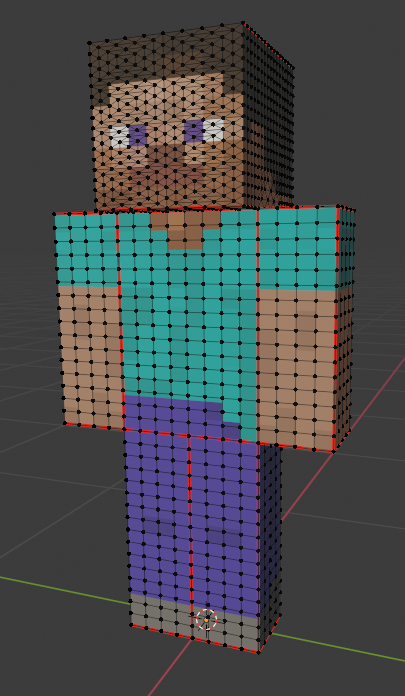 | 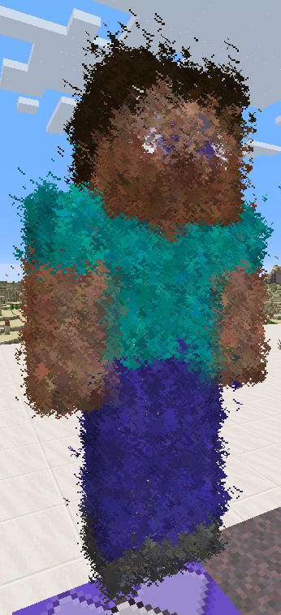

#### Umbreon

Model | Result
:----:|:-----:
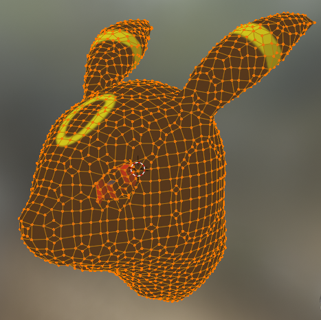 | 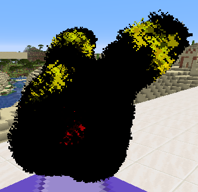

#### Planet

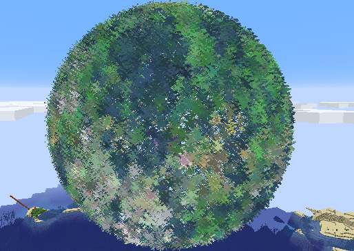

### Single color

#### Katana

Model | Result
:----:|:-----:
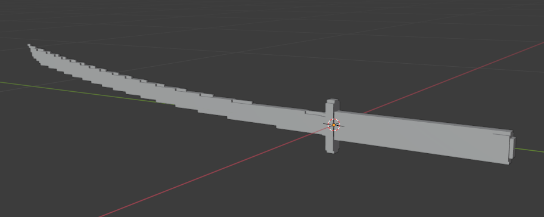 | 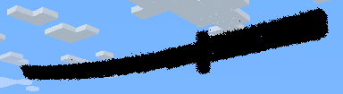

#### Steve-like

Model | Result (impulse) | Result (repeating)
:----:|:----------------:|:-----------------:
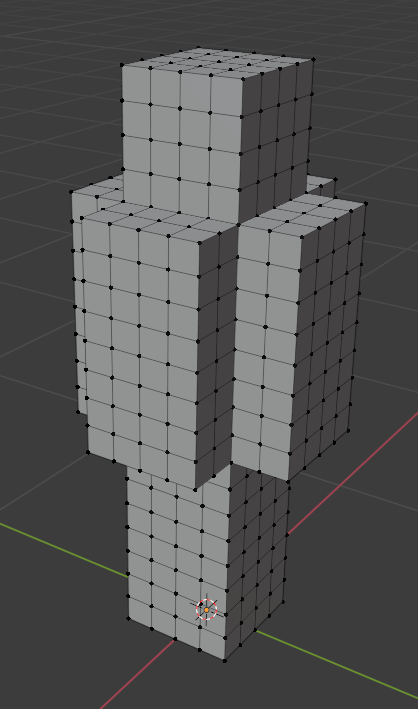 | 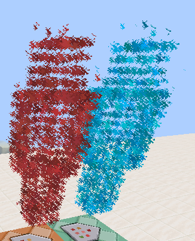 | 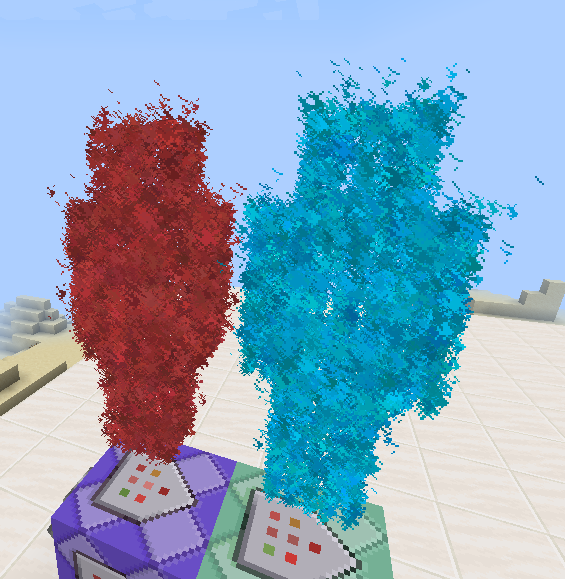

#### Crewmate

Model (by Ikki_3d, remeshed to reduce polycount) | Result
:-----------------------------------------------:|:-----:
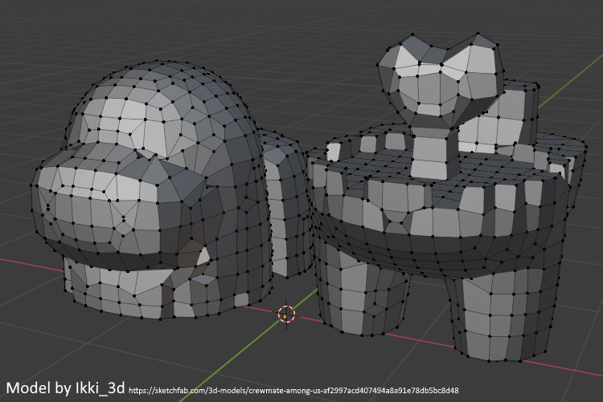 | 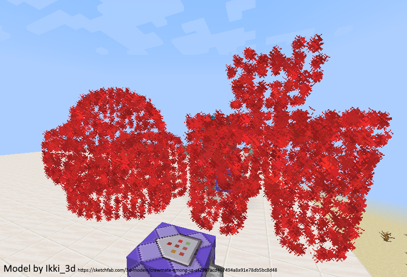

## Special thanks

This program makes use of the [`stb_image` library](https://github.com/nothings/stb/blob/master/stb_image.h).
