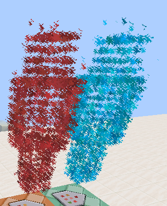

# Dust particle generator

A Unix program (I imagine it should compile on Windows) that creates mcfunction files that spawn dust particle clouds, from the vertices described in an OBJ file, and one that creates said files from a hard-coded bounding box.

Color mapping is yet unsupported, all the cloud will have the same color, specified in the arguments of the program.

## Compilation

Run `make` or `make gen_obj` to compile the OBJ-based generator.

Run `make gen_grid` to compile the bounding-box-based generator.

Run `make gen_obj_example` for an example that uses `shape.obj` (needs to be provided) to create a `red_shadow` and a `cyan_shadow` functions.

Run `make clean` to remove the executables.

## Usage

`gen_obj <input file> <output file> <r> <g> <b> <particle size> <boxX> <boxY> <boxZ> <speed> <count> <chance of the particle being 'force' instead of 'normal'>`

`gen_grid` (hard-coded values, change them in `gen_grid.c`)

## Gallery

### Steve

Model:

Result (impulse):

Result (repeat):

### Crewmate

Model (by Ikki_3d, remeshed to reduce polycount):

Result (repeat):

